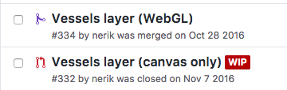
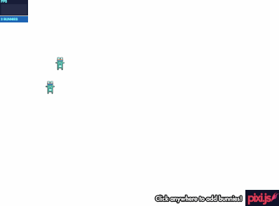
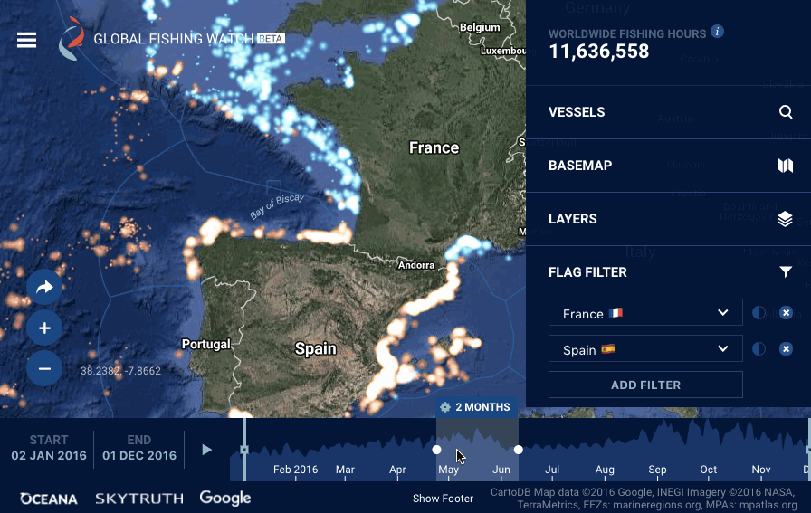

# Saving the fish with bunnies: how we used pixi.js for temporal mapping

# Saving the 🐟 with 🐰 : how we used Pixi.js for temporal mapping

Context: joint effort with Google, Oceana and Skytruth
- a total 150,000 vessels
- up to 100,000 points rendered at the same time
- 4+ years of data
 our partner Skytruth delivers highly efficient binary vector tiles, where points are cluster both in time and spatially.

I want to focus here on how we achieved the "heatmap" style of this map, with reasonably good performance, a maintainable, high-level codebase, and still some sanity left.

alternative to Mapbox GL
- Google Maps
- custom tileset format, with a custom GIS pipeline

### Early explorations: Canvas 2D and Torque

Explored canvas. used successfully in Global Forest Watch, though the rendering style is different, aka we are encoding values into pixels, while we were aiming at the already mentioned "heatmap" style. We had a few debates on how

Didn't perform well *at all* the rendering style we had in mind (initial Skytruth prototype).
There are many techniques to try to make canvas 2d rendering faster: shadow canvas, batch drawing API calls, grouping drawing commands by color/opacity, avoid sub-pixel rendering, staring at your screen with creepy eyes, <a href="https://www.html5rocks.com/en/tutorials/canvas/performance/">etc</a>.

<a href="https://github.com/Vizzuality/GlobalFishingWatch/pull/332">I wish I knew earlier</a>, but this battle is basically lost in advance. There's just no way a CPU can handle moving that much heatmap brushes above 5 fps on a desktop, let alone a mobile CPU.

Naturally an awesome contender when you think of spatiotemporal animations: <a href="https://carto.com/torque/">CARTO's Torque</a>. Torque works by mashing SQL tables into preprocessed tilecubes, then rendered into a good old canvas 2D. It can deliver relatively good performance with typical datasets, because there is a step of spatial and temporal aggregation done 'offline'. It is an amazingly smart way to tackle the problem but unfortunately it comes "by nature" with two major flaws:
- you can't do any client side changes to the rendering, which makes interaction niceties such as mouse hover effects impossible to achieve;
- interacting with the time attributes is very limited. Changing the time span rendered requires changing your SQL query and do a roundtrip with the server. But we had high ambitions:

Additionally, Torque is not able to render, at the time of writing, anything else than points. We needed lines to render the vessel trajectories, so going with Torque would have forced us to use a separate solution for vessel tracks (pain and suffering ahead).

### All hail WebGL

So after a good deal of hesitations and hair pulling, this day finally happened:

We dropped all hope of using canvas 2D, and went with a shiny new WebGL implementation instead.

WebGL is tapping into the raw power of Graphic Processing Units (GPUs). Things a GPU is good at. Heating up the room. Drawing a million times the same thing, insanely fast. Sounds like it could work for us. We want to draw heatmap brushes to represent fishing vessels, a lot of times (they are almost the same, but size, opacity and tint vary, so we might have to be a bit smart about this).

In terms of programming, WebGL is a wildly different beast than canvas 2D. It allows your puny JS code to talk to your GPU through OpenGL Shading Language (GLSL), a language similar to C or C++. GLSL is very, very terse, difficult to debug, and hard to maintain. _[whispered, sobbing voice] I'm afraid of GLSL. Can I go home now ?_.

It turns out there are a bunch of very smart(er) people out there, willing to do the hard work for us, which is: exposing GLSL functionality to a high level API in JavaScript, typically using some stage hierarchy paradigm, think `container.addChild(sprite); sprite.x = 42;` (oooh the glorious days of Flash, may you rest in peace). Those smart people build what's called <a href="https://html5gameengine.com/">2D rendering libraries for the browser</a>: Phaser, Pixi.js, HaxeFlixel, etc. Those libraries are typically used to develop games, but why not for tracking illegal fishing on a map as well?

So how do you pick a rendering engine? Project's activity on GitHub, quality of the documentation, reputation ? Yeah, sure, but more importantly: BUNNIES !

Yes, people use bouncing bunnies to measure a 2D graphics engine performance, why? Since Pixi.js can render and animate <a href="http://www.goodboydigital.com/pixijs/bunnymark/">tens of thousands of bunnies</a> on a blank canvas without breaking a sweat, it will surely render and animate tens of thousands of fishing vessels on a map.

So we can stay in the nice High-level-land of JavaScript, while leaving the GLSL logic to tested and proven codebases. We focus on highly maintainable, abstract code that ties well with our application model (Redux) and the rest of the UI rendering logic (React), while all the "dirty work" is done by the rendering engine.

As an added bonus, Pixi.js can fallback to rendering into a canvas 2D, for older setups (you might be surprised for instance, to learn that the Intel HD 3000 GPU, which equips a lot of 2010-2012 macbooks, <a href="https://twitter.com/alteredq/status/783240214584107008">is on Chrome's WebGL blacklist</a>). We even discovered, as a late minute surprise, that the performance with this mode was quite tolerable.

### Tinting and switching brush styles

ZEE Espagne/France

### Compute graphical attributes 'offline'
JS is the bottleneck

### Map / canvas interaction

Handling projection, use world coordinates

Do NOT render while panning or zooming

### Pooling

Move sprites off-stage, instead of instanciating/removing

### Conclusion

Phew, that was a journey. BTW, Vizzuality is looking for talented people to stop illegal fishing and deforestation by working on that kind of challenges.
