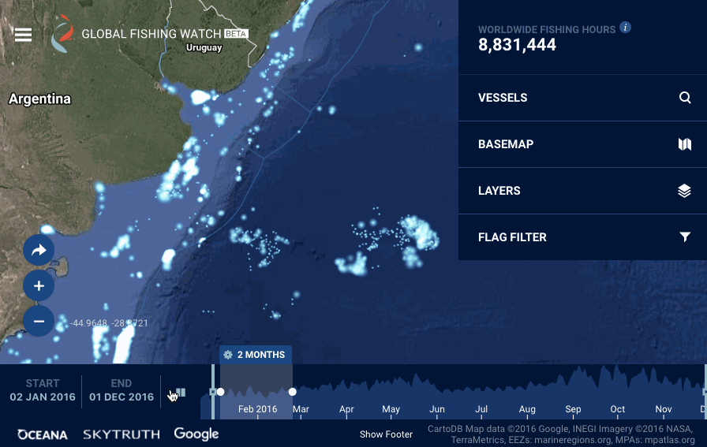
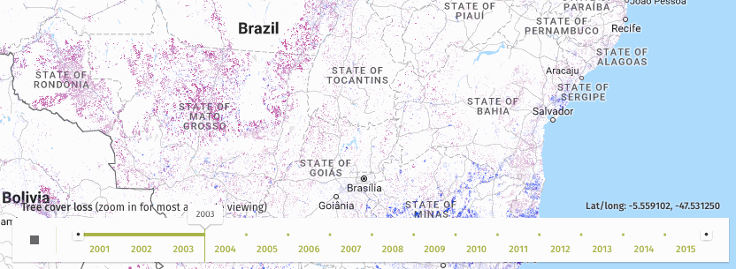
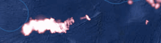
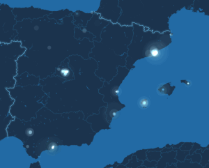
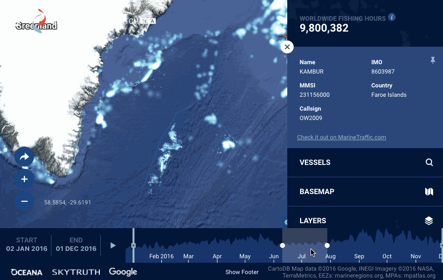

# Saving the 🐟 with 🐰 : how we used Pixi.js for temporal mapping

Our planet's fish reserves are dwindling because of overfishing and illegal fishing - estimated at a third of the overall fishing worldwide. We need to understand what's happening in our oceans. <a href="https://www.youtube.com/watch?v=ISbIUjCz8Pg">"We need to know who is fishing where. Until now, we were blind"</a>.

The way we fix this problem is by using humanity's source and solution to all problems: **a map**.

<a href="globalfishingwatch.org/">GlobalFishingWatch</a> is a free and global monitoring system for citizens, journalists, NGOs, governments, fishermen and seafood suppliers. It's <a href="https://www.youtube.com/watch?v=uVpwBzFnxI8">"going to change the way illegal fishing is done"</a>, by providing access to detailed information about over 150,000 fishing vessels over the last 4 years.

Where is this data coming from? <a href="http://www.economist.com/news/briefing/21722629-oceans-face-dire-threats-better-regulated-fisheries-would-help-getting-serious-about">This article</a> from The Economist sums it up neatly:

> The International Maritime Organisation (IMO) requires ships over 300 tonnes to have an Automatic Identification System (AIS), a radio transmitter which tells anyone in the vicinity the boat’s position, speed and identity so as to avoid collisions. (...)

> Global Fishing Watch, an online platform created by Google, Oceana, a marine charity, and Sky Truth, which uses satellite data to further environmental causes, is a keen user of AIS transmissions. They do not just let it locate fishing vessels; they let it take a good guess as to what they are doing (boats long-lining for tuna, for example, zigzag distinctively).

Skytruth has been doing a tremendous work building the early prototype, analyzing this gigantic dataset and providing highly efficient binary vector tiles, where points are clustered both spatially and in time. More on this in Skytruth's technical portal, <a href="http://globalfishingwatch.io/">globalfishingwatch.io</a>.

We, at <a href="vizzuality.com">Vizzuality</a>, had the chance to  implement the vision on the users facing side of things, building an interactive and animated visualisation on top of the dataset. I want to talk here about our discoveries, failures and successes achieving the animated "heatmap" style of this map, with reasonably good performance, a maintainable, high-level codebase, and a bit of sanity left.

### Early explorations: Canvas 2D and Torque

We already had experience building an animated heatmap with Canvas 2D, this time not to save fish, but forests, in project called <a href="http://www.globalforestwatch.org/">GlobalForestWatch</a>. This for instance shows the tree cover loss in the southern Amazonia from 2001 to 2015:

Canvas 2D is an API that allows drawing shapes, text and images into a drawing surface. But really what it does is just, basically, moving pixels around. Instead of using the GPU, the dedicated graphics unit of a computer or phone, Canvas 2D relies solely on the processor (CPU) to render graphics. Notwithstanding this, it can achieve solid performance, at least with that kind of pixellated rendering style. The technique, in a nutshell: prepare a typed array containing all pixel values (<a href="https://developer.mozilla.org/en-US/docs/Web/JavaScript/Reference/Global_Objects/Uint8ClampedArray">`Uint8ClampedArray`</a>), dump those pixels them into your canvas all at once (<a href="https://developer.mozilla.org/en-US/docs/Web/API/CanvasRenderingContext2D/putImageData">`putImageData()`</a>). Done.

We started early prototypes of GlobalFishingWatch with that approach, but we were aiming at a different rendering style. While the pixellated style works well for analysis, we were looking for something that would convey the idea of a "pulsating" activity, highlighting fishing seasons variations and their potential impact on the environment.

To achieve this kind of heatmap effect, we need to blend many many times "brushes strokes" (a tiny picture with a radial gradient gradually transparent) into the canvas, each brush representing here a point in time and space where a vessel caught fish. We can then play with the size and opacity of the brushes to encode a variable such as fishing activity.

Can we do that with Canvas 2D? There are many techniques to try to make it perform faster: shadow canvas, batch drawing API calls, grouping drawing commands by color/opacity, avoid sub-pixel rendering, staring at your screen with a desperate look, <a href="https://www.html5rocks.com/en/tutorials/canvas/performance/">etc</a>.

<a href="https://github.com/Vizzuality/GlobalFishingWatch/pull/332">I wish I knew earlier</a>, but the truth is that this battle is basically lost in advance. There's just no way a CPU can handle moving that much brushes on a desktop (we're talking tens of of thousands) above sluggish speeds at best - let alone with a phone CPU.

### A true "heatmap" style: Torque ?

Naturally an awesome contender when you think of spatiotemporal animations: <a href="https://carto.com/torque/">CARTO's Torque</a>, <a href="http://www.vizzuality.com/projects/BBVA">which we used a few times in the past</a> and continue using a lot in many of our projects.

Torque works by mashing SQL tables into preprocessed <a href="https://github.com/CartoDB/torque-tiles">tilecubes</a>, then rendered into a good ol' Canvas 2D. It can deliver very good performance with most datasets, because there is a crucial step of spatial and temporal aggregation done 'offline'. It is an amazingly smart way to tackle the problem, but unfortunately in this particular project we faced two major challenges:
- because of the above mentioned pre-processing step, you can't do instant client side changes to the rendering, which makes some interaction patterns, such as highlighting same-vessel points on mouse hover, harder to carry out;
- we needed a great deal of dynamic interaction with timeframes. Changing the rendered time span is totally possible with Torque, but requires changing your SQL query and/or CartoCSS code, and by doing so causing a roundtrip with the server. But we had high ambitions:

Meaning: changing the displayed time span of the fishing events  dynamically on the client side.

Additionally, Torque is fast and reliable when drawing points, but we also needed lines to render the vessel trajectories, so going with Torque would have required us to use a separate solution for vessel tracks.

### All hail WebGL

So after a good deal of hesitations and hair pulling, this day finally happened:

We dropped all hope of using canvas 2D, and went with a shiny new WebGL implementation instead.

WebGL is tapping into the raw power of Graphic Processing Units (GPUs). A GPU is good at a few things:
- heating up the room during long winter nights
- drawing a million times the same thing, insanely fast.

Sounded like it could work for us. We wanted to draw heatmap brushes to represent fishing vessels, a lot of times. Brushes are almost the same, but size, opacity and tint will vary - hence a few tricks explained later on.

On the programming side, WebGL is a wildly different beast than canvas 2D. It allows your puny JS code to talk to the GPU through OpenGL Shading Language (GLSL), a language similar to C or C++. GLSL is very, very terse, difficult to debug, and hard to maintain. _[whispered, sobbing voice] I'm afraid of GLSL. Can I go home now ?_

It turns out there are a bunch of very smart(er) people out there, doing the hard work for us: exposing GLSL functionality to a high level API in JavaScript, typically using some stage hierarchy paradigm - think `container.addChild(sprite); sprite.x = 42;` (oooh the glorious days of Flash, may you rest in peace). We're talking about <a href="https://html5gameengine.com/">2D rendering engines for the browser</a>: Phaser, Pixi.js, HaxeFlixel, etc. Those libraries are typically used to develop games, but why not for tracking illegal fishing on a map as well?

So how do you pick a rendering engine? Project's activity on GitHub, quality of the documentation, reputation ? Yeah, sure, but more importantly: **BUNNIES** !

Yes, people use bouncing bunnies to measure an engine's performance. Since <a href="http://www.pixijs.com/">Pixi.js</a> can render and animate <a href="http://www.goodboydigital.com/pixijs/bunnymark/">tens of thousands of bunnies</a> on a canvas without breaking a sweat (using the <a href="http://pixijs.download/dev/docs/PIXI.particles.ParticleContainer.html">ParticleContainer</a>), it will surely render and animate tens of thousands of fishing vessels on a map.

So we could stay in the nice High-level-land of JavaScript, while leaving the GLSL logic to a tested and proven codebase. We could focus on highly maintainable, abstract code that ties well with our application model (Redux) and the rest of the UI rendering logic (React), while we relied on the "dirty work" being done by the rendering engine.

As an added bonus, Pixi.js can fallback to rendering into Canvas 2D, for older setups (you might be surprised for instance, to learn that the Intel HD 3000 GPU, which equips a lot of 2010-2012 macbooks, <a href="https://twitter.com/alteredq/status/783240214584107008">is on Chrome's WebGL blacklist</a>). Turned out that the performance with Pixi.js' Canvas 2D mode was actually tolerable, which is quite an amazing feat.

### Tinting and switching brush styles

So WebGL is fast and all, but it didn't mean that we didn't have to be a little bit smart. When talking to a graphics API such as WebGL, what's often "expensive" is not what's happening within the GPU realm, but rather on the CPU side.

At the lowest level, we have **draw calls**. A draw call is a set of instructions prepared by the CPU and sent to the GPU, and is usually one of the main bottlenecks when doing accelerated graphics.

One of the ways to reduce the number of draw calls is to limit the number of textures we are going to use. Take for example this animation, showing French and Spanish vessels across the borders of the respective countries <a href="http://blog.globalfishingwatch.org/2016/07/who-owns-the-fish-high-seas-and-the-eezs/">Exclusive Economic Zones</a>. We needed different colors to distinguish Spanish and French vessels:

Instead of using two textures for the two brush colors, we had them share the same texture, using a technique called **texture atlasing**:

When rendering a **sprite**, instead of setting a texture per country/rendering style, we'll just crop a portion of that big **spritesheet**, the relevant part for both hue and rendering styles (the solid circles on the right are used at higher zoom levels).

We end up with a single geometry, containing all sprites of the scene, using a single texture, which amount to a single draw call. The only thing left to update are the sprites texture offsets, **positions and sizes** (in the GPU world, vertices UVs and transforms).

### Compute graphical attributes 'offline'

So how did we actually update those positions and sizes ? We had to get them from the raw tiles data, which contains the latitude and longitude of fishing points, as well as two variables encoding the amount of fishing happening, and convert them to point and positions on the screen.

This is a costly operation, all happening on the CPU side:
- fishing activity must be translated to a sprite size and opacity, which also depends on the current zoom level.
- latitude and longitude, must be projected to coordinates on the screen

The strategy here was to precompute these values right after a tile gets loaded, instead of doing it at each step of the animation. There are future plans to "bake" those calculated values in the tiles. Which in fact is the more typical vector tiles scenario: tiles don't carry meaningful data (geography, toponymy, etc), but mere drawing instructions, or purely geometrical data with tile-relative coordinates.

### Map / canvas interaction

While the dataset provides latitudes and longitudes, which represent a position on the surface of a sphere (angles), they have to first be projected on a 2D plane, aka "world coordinates" (using the Web Mercator projection), then to screen coordinates, all on the client side.

Our approach was:
1. at tile load: project latitude and longitude to **world coordinates**
2. at rendering frame time: convert world coordinates to viewport coordinates in pixels

We found out that world coordinates made for a convenient and flexible "exchange format", in our scenario.

One thing worth mentioning too: it is not a good idea to keep recalculating viewport coordinates and rendering while panning or zooming. Although slightly more complex, offsetting the whole canvas while panning (and recalculating pixel coordinates offsets on map idle) was necessary to get acceptable UI response times - as well as freezing rendering while zooming.

### Pooling

One other trick we used is probably almost as old as computer graphics: pooling.

Each distinct point in our fishing map is represented by a **sprite**, which is a JavaScript object, before being fed to a WebGL shader. A naive approach consists in instantiating the number of objects you need at each animation frame, but we quickly realized that:
- creating those objects is costly: animation framerate will drop drastically becuase of this;
- deleting those objects (done automatically by the <a href="https://medium.com/@_lrlna/garbage-collection-in-v8-an-illustrated-guide-d24a952ee3b8">garbage collector</a>): you get whole batches of frames skipped at unpredictable times.

Creating all those JavaScript objects is the cost of using higher level abstractions (in lieu of directly interacting with the GPU). You trade a little bit of performance, for code expressiveness, which seemed appropriate for this project.

So to skirt that performance limitation we used the pooling strategy:
1. make a generous estimation of how many sprites you will need (here, depending on the time span selected and the viewport size);
2. instantiate that number of sprites objects at once, store them into a pool;
3. at each frame, position on the canvas as many sprites as you need to render that frame;
4. keep the leftover sprites just moving them off-stage, instead of deleting them
5. whenever time span or viewport size changes, instantiate more sprites (if needed).

### Rendering tracks

Analyzing a vessel trajectory in detail gives insight not only about the where but about the what: as mentioned earlier, navigation patterns can give a pretty good idea about what type of fishing activity happened somewhere.

To render vessel tracks, we tapped into Pixi.js's <a href="http://pixijs.download/dev/docs/PIXI.Graphics.html">Graphics API</a>, which uses either GL lines or triangles strips. With both modes, we are not yet entirely happy with the performance, so definitely a work in progress here.

### The 🐘 in the room

Why yes, I managed to write a whole post about maps and WebGL, in 2017, without even mentioning Mapbox. Mapbox basically brought vector tiles and GPU accelerated maps to the wide mapping community (including non tech). They host OSM-based or custom data vector tiles, that are delivered through a JS client (<a href="https://github.com/mapbox/mapbox-gl-js">Mapbox GL JS</a>) or native clients for mobile. The "holistic" approach of the map stack allows for stunning maps, with smooth transitions, client-side restyling, multilingual labels, etc, all rendered by the GPU, usually at a good solid 60 fps for regular use cases.

One reason we went with a different approach is primarily that using Google Maps was an initial requirement, which virtually barred Mapbox from our options from the start. Add to that a completely custom GIS pipeline not designed from the start to produce vector tiles in formats compatible with Mapbox GL JS (it would likely be PBF in our case).

But in hindsight, using a completely different stack was an interesting journey, and &lt;insert self praise here&gt;.

### Plug

We're hiring! If you're an engineer who wants to support social good with your skills, <a href="http://vizzuality.github.io/job-offers/?platform=hootsuite#fullstack">get in touch</a>!

_Special thanks go to Tiago, who's an amazing engineer to work with, and who manages to deal with my grumpiness by being even grumpier._
